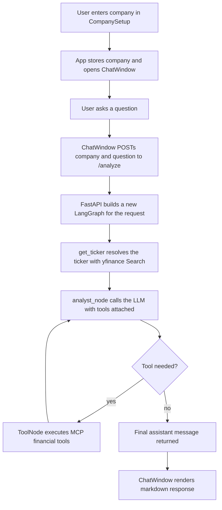

# Financial Analyst Agent

An AI-powered financial research app that lets you pick a company, ask questions in natural language, and receive markdown-formatted financial analysis backed by live Yahoo Finance data through an MCP tool server.

## What the project does

The application has two parts:

1. A React + Vite frontend for selecting a company and chatting with the analyst.
2. A FastAPI backend that runs a LangGraph agent, connects to an MCP server, resolves company tickers, and asks an LLM to produce the answer.

The agent does not invent financial data. It first maps the company name to a ticker, then calls financial tools when the model needs real market or statement data.

## Quick Start

### 1. Backend setup

Create and activate a Python environment, then install the backend dependencies:

```powershell
python -m venv .venv
.\.venv\Scripts\Activate.ps1
pip install -r requirements.txt
```

Create a `.env` file in the repository root with the backend API key expected by the code:

```env
GROQ_API_KEY=YOUR_GROQ_API_KEY
GROQ_MODEL=openai/gpt-oss-120b
```

The backend uses `ChatGroq` (via `langchain-groq`) to connect to the Groq API. The model name can be overridden with `GROQ_MODEL`.

Start the FastAPI server:

```powershell
uvicorn main:app --reload --host 0.0.0.0 --port 8000
```

### 2. Frontend setup

Install frontend dependencies and start Vite:

```powershell
cd frontend
npm install
npm run dev
```

Create a frontend environment file so the UI knows where the backend is running:

```env
VITE_API_URL=http://localhost:8000
```

If your backend is hosted elsewhere, point `VITE_API_URL` at that base URL instead.

### 3. Open the app

Open the Vite URL shown in the terminal, enter a company name, and start asking questions.

## Full Run Workflow



## Agentic Workflow

This project uses a small agent loop rather than a single prompt-response call.

1. The frontend sends the selected company and the user's question to the backend.
2. The graph first runs [user_input.py](user_input.py) to search Yahoo Finance and infer a ticker symbol.
3. The graph then runs [analyst.py](analyst.py), which creates the LLM, attaches the available tools, and sends a system prompt that tells the model to use tools whenever real financial data is required.
4. If the model requests a tool, LangGraph routes execution to the `ToolNode`.
5. Tool calls are served by the MCP server in [mcp_server/financial_tools.py](mcp_server/financial_tools.py), which fetches data from Yahoo Finance through `yfinance`.
6. The graph loops back into the analyst node until the model produces a final answer.

The important design choice is that the LLM is not trusted as the source of record for financial facts. It is the reasoning layer, while the MCP tools are the data layer.

## MCP Server

The backend launches the MCP server from [mcp_server/financial_tools.py](mcp_server/financial_tools.py) using `MultiServerMCPClient` in [graph.py](graph.py).

Current tools exposed by the server:

1. `get_financials(ticker)` - returns the Yahoo Finance income statement.
2. `get_balance_sheet(ticker)` - returns the Yahoo Finance balance sheet.
3. `get_market_data(ticker)` - returns current market and valuation data from Yahoo Finance.

The server runs over standard I/O, so the graph can start it as a child process and pull the tools directly into the agent runtime.

## Project Structure

### Root backend files

- [main.py](main.py) - FastAPI entry point with the `/` health check and `/analyze` endpoint.
- [graph.py](graph.py) - Builds the LangGraph, connects the ticker lookup, analyst node, and MCP tool node, and compiles the graph per request.
- [analyst.py](analyst.py) - Creates the LLM, binds tools, injects the system prompt, and returns the assistant response.
- [state.py](state.py) - Defines the shared LangGraph state shape used across the workflow.
- [user_input.py](user_input.py) - Resolves a company name to a ticker using Yahoo Finance search.
- [requirements.txt](requirements.txt) - Python dependencies for the backend and MCP server.

### MCP server files

- [mcp_server/financial_tools.py](mcp_server/financial_tools.py) - MCP tool definitions that fetch financial statements and market data from Yahoo Finance.
- [mcp_server/__init__.py](mcp_server/__init__.py) - Marks the directory as a Python package.

### Frontend files

- [frontend/package.json](frontend/package.json) - Frontend scripts and package dependencies.
- [frontend/vite.config.js](frontend/vite.config.js) - Vite configuration with React and Tailwind support.
- [frontend/eslint.config.js](frontend/eslint.config.js) - ESLint configuration for JavaScript and JSX.
- [frontend/index.html](frontend/index.html) - Vite HTML shell that mounts the React app.
- [frontend/README.md](frontend/README.md) - Default Vite template README.
- [frontend/src/main.jsx](frontend/src/main.jsx) - React bootstrap file that mounts the app.
- [frontend/src/App.jsx](frontend/src/App.jsx) - Controls the company setup screen and the chat screen.
- [frontend/src/index.css](frontend/src/index.css) - Global styles for the frontend.
- [frontend/src/App.css](frontend/src/App.css) - App-level CSS entry retained from the Vite scaffold.
- [frontend/src/components/CompanySetup.jsx](frontend/src/components/CompanySetup.jsx) - First screen where the user enters a company name.
- [frontend/src/components/ChatWindow.jsx](frontend/src/components/ChatWindow.jsx) - Chat interface that sends prompts to the backend and renders responses.
- [frontend/src/components/ChatMessage.jsx](frontend/src/components/ChatMessage.jsx) - Markdown message renderer for user and assistant messages.
- [frontend/src/assets/](frontend/src/assets/) - Static frontend assets; currently empty.

## How the Frontend Works

The React app starts in [frontend/src/main.jsx](frontend/src/main.jsx), which renders [frontend/src/App.jsx](frontend/src/App.jsx).

`App.jsx` manages one simple state transition:

1. Before a company is chosen, it renders `CompanySetup`.
2. After the company is submitted, it renders `ChatWindow` with the selected company name.

Inside `ChatWindow`:

1. The user types a question or clicks a suggestion.
2. The component immediately appends the user message to local chat state.
3. It POSTs `{ company, question }` to `${VITE_API_URL}/analyze`.
4. It receives the final LangGraph state from the backend.
5. The last assistant message is rendered with `ChatMessage`, which uses `react-markdown` and `remark-gfm` so the answer can include lists, tables, code blocks, and other markdown formatting.

## How the Backend Works

The backend entry point is [main.py](main.py).

### Request flow

1. `GET /` returns a simple health payload.
2. `POST /analyze` receives a company name and question.
3. The endpoint calls `create_graph()` from [graph.py](graph.py).
4. A fresh initial state is assembled with the company, an empty ticker slot, and the user's message.
5. `graph.ainvoke(...)` runs the agent pipeline and returns the final state.

### Why the graph is built per request

The current code creates the graph inside `/analyze` instead of globally. That means the MCP client and tool discovery are rebuilt for each request, which keeps the request logic simple and isolated, but adds some overhead.

## File-by-File Details

### [main.py](main.py)

- Defines the FastAPI app.
- Configures CORS for local development and the deployed frontend origin currently listed in code.
- Exposes the health route and the `/analyze` route.
- Starts the LangGraph pipeline for each analysis request.

### [graph.py](graph.py)

- Creates a `MultiServerMCPClient` that launches [mcp_server/financial_tools.py](mcp_server/financial_tools.py) with the same Python interpreter as the backend.
- Loads the tools from the MCP server.
- Creates a `StateGraph` using the shared `AgentState`.
- Adds three nodes: `get_ticker`, `analyst`, and `tools`.
- Wires the graph so the analyst can loop through tools until it finishes.

### [analyst.py](analyst.py)

- Loads environment variables with `python-dotenv`.
- Creates the LLM client.
- Binds the MCP tools to the model.
- Supplies a system prompt that instructs the model to use tools for real data and avoid hallucinating financial facts.

### [state.py](state.py)

- Defines the `AgentState` TypedDict.
- Stores company metadata, ticker symbol, conversation messages, and result buckets for financial data, web data, and artifacts.
- Uses LangGraph message accumulation so the conversation history can be preserved across tool loops.

### [user_input.py](user_input.py)

- Uses Yahoo Finance search to find matching tickers for the selected company.
- Returns the first equity result it finds.
- Falls back to `not available` if no equity ticker can be resolved.

### [mcp_server/financial_tools.py](mcp_server/financial_tools.py)

- Defines the MCP server with `FastMCP`.
- Wraps Yahoo Finance reads into callable tools.
- Runs as a standard I/O MCP process when started by the graph.

### [frontend/src/components/CompanySetup.jsx](frontend/src/components/CompanySetup.jsx)

- Renders the company entry screen.
- Prevents empty submissions.
- Hands the trimmed company name back to `App.jsx`.

### [frontend/src/components/ChatWindow.jsx](frontend/src/components/ChatWindow.jsx)

- Holds the user conversation state.
- Sends the backend request.
- Shows loading state while waiting for the answer.
- Renders assistant output through `ChatMessage`.
- Includes a few starter prompts for common financial questions.

### [frontend/src/components/ChatMessage.jsx](frontend/src/components/ChatMessage.jsx)

- Renders user and assistant messages differently.
- Uses `react-markdown` and `remark-gfm` to support markdown tables, lists, blockquotes, and code.
- Applies custom styles so financial answers remain readable.

### [frontend/src/main.jsx](frontend/src/main.jsx)

- Mounts the React app into the root DOM node.

### [frontend/vite.config.js](frontend/vite.config.js)

- Enables React support in Vite.
- Adds Tailwind integration.

### [frontend/eslint.config.js](frontend/eslint.config.js)

- Sets up linting for JavaScript and JSX.
- Enables React hooks and refresh rules.

## API Endpoints

### `GET /`

Health check.

Response:

```json
{ "status": "ok" }
```

### `POST /analyze`

Request body:

```json
{
  "company": "NVIDIA",
  "question": "Evaluate NVIDIA profitability"
}
```

Response:

`POST /analyze` returns a **stream** of newline-delimited JSON (NDJSON) events. Each line is a JSON object:

- `{"type": "token", "content": "..."}` — a chunk of the assistant's response text (token or tool call annotation)
- `{"type": "done"}` — signals the end of the response
- `{"type": "error", "content": "..."}` — signals a failure

The frontend accumulates the token events and renders the result as markdown.

## Environment Variables

Backend:

- `GROQ_API_KEY` - required by [analyst.py](analyst.py) for the Groq LLM client.
- `GROQ_MODEL` - the Groq model to use (defaults to `openai/gpt-oss-120b`).

Frontend:

- `VITE_API_URL` - base URL for the FastAPI server.

## Useful Commands

Backend:

```powershell
uvicorn main:app --reload
```

Frontend:

```powershell
cd frontend
npm run dev
npm run build
npm run lint
```

## Notes

- The app depends on network access to Yahoo Finance and the configured LLM provider.
- If the frontend cannot reach the backend, check `VITE_API_URL` and make sure FastAPI is running.
- If tool calls fail, verify that the MCP server file [mcp_server/financial_tools.py](mcp_server/financial_tools.py) can be launched by the same Python interpreter used for the backend.
- The frontend currently expects markdown-formatted answers, so the assistant output is rendered with markdown support instead of plain text.

## Extending The Project

If you want to add more tools, expand the MCP server and expose new functions through `FastMCP`. The LangGraph workflow will pick them up through the MCP client as long as they are registered and returned by tool discovery.

If you want to support additional data sources, the safest place to add them is the MCP layer, not inside the prompt. That keeps external data access explicit and easier to test.